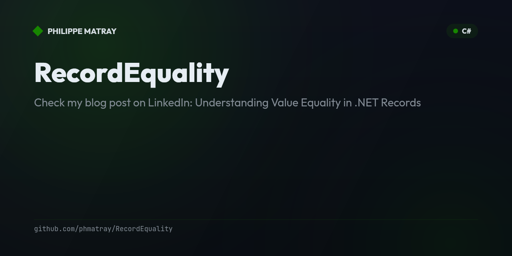

# Value Equality in .NET Records with ValueCollection

Check my blog post on LinkedIn: [Understanding Value Equality in .NET Records](https://www.linkedin.com/pulse/understanding-value-equality-net-records-philippe-matray--cdlke/)

## Overview

This project demonstrates how to achieve true value equality in .NET records, particularly when dealing with
collections. The default equality behavior of .NET records works well for value types and immutable properties but falls
short when records contain collections, which are typically compared by reference rather than by their contents.

To address this limitation, this project introduces `ValueCollection<T>`, a custom collection type that provides
value-based equality for collections, ensuring that records containing such collections can be correctly compared by
their values.

## Key Concepts

- **.NET Records**: Records are reference types with value-based equality in C#. They are ideal for representing
  immutable data models.
- **Value Equality**: The concept that two objects are considered equal if their values are the same, regardless of
  whether they reference the same memory address.
- **Challenges with Collections**: By default, collections like `List<T>` use reference equality, which can cause
  equality checks on records to fail even if the collection contents are identical.
- **`ValueCollection<T>`**: A custom collection type that overrides equality methods to ensure that collections are
  compared based on their values, not their references.

## Project Structure

- **Records**: This project includes two records to demonstrate value equality: `BadOrder` and `GoodOrder`.
    - `BadOrder`: Uses `List<OrderItem>` and fails equality checks due to reference-based collection comparison.
    - `GoodOrder`: Uses `ValueCollection<OrderItem>` to ensure value-based comparison for the collection.
- **`ValueCollection<T>` Implementation**: A custom collection class that extends `ReadOnlyCollection<T>` and overrides
  the `Equals`, `GetHashCode`, and `ToString` methods to support value-based equality.
- **Unit Tests**: Tests are included to verify the equality behavior for `BadOrder` and `GoodOrder`, as well as to
  demonstrate the functionality of `ValueCollection<T>`.

## Usage

### Records

The project defines two primary records:

- `BadOrder`:
  ```csharp
  public record BadOrder(string OrderId, string CustomerName, List<OrderItem> Items);
  ```
- `GoodOrder`:
  ```csharp
  public record GoodOrder(string OrderId, string CustomerName, ValueCollection<OrderItem> Items);
  ```

The `GoodOrder` record uses `ValueCollection<OrderItem>` for the `Items` property, which ensures that two instances with
identical `Items` will be considered equal.

### ValueCollection<T>

The `ValueCollection<T>` class is a custom collection type that provides value-based equality for its elements:

```csharp
public class ValueCollection<T>(params IList<T> values)
    : ReadOnlyCollection<T>(new List<T>(values))
{
    // Adds an item to the collection
    public void Add(T item) { ... }

    // Determines whether the specified object is equal to the current object
    public override bool Equals(object? obj) { ... }

    // Returns the hash code for the current object
    public override int GetHashCode() { ... }

    // Returns a string representation of the collection
    public override string ToString() { ... }
}
```

The class is designed to be immutable, aside from the provided `Add` method, and ensures value-based equality checks.

### Running Tests

The project includes unit tests to verify the behavior of `ValueCollection<T>` and the equality checks for records.

- **TestBadOrderEquality**: Demonstrates the failure of equality checks for `BadOrder` due to reference equality of
  `List<T>`.
- **TestGoodOrderEquality**: Verifies that `GoodOrder` instances are correctly considered equal when they contain
  identical items.
- **TestValueCollection**: Tests the behavior of `ValueCollection<T>` for adding items, equality, and string
  representation.

## Example Code

### Equality Test for GoodOrder

```csharp
[Test]
public void TestGoodOrderEquality()
{
    OrderItem item1 = new("ProductA", 2, 10.0m);
    OrderItem item2 = new("ProductB", 1, 20.0m);

    GoodOrder order1 = new("Order1", "John Doe", [item1, item2]);
    GoodOrder order2 = new("Order1", "John Doe", [item1, item2]);

    Assert.That(order1, Is.EqualTo(order2)); // This line will pass
}
```

## Advantages of ValueCollection<T>

- **Consistent Equality Semantics**: Ensures that two instances of a record are treated as equal if their collections
  contain equivalent elements.
- **Simplified Testing**: Equality behavior aligns with expectations for value-based objects, making tests easier to
  write and maintain.
- **Enhanced Readability**: The use of `ValueCollection<T>` clarifies the intent that collections should be treated as a
  set of values rather than references.

## Installation and Setup

1. Clone the repository:
   ```sh
   git clone https://github.com/phmatray/RecordEquality.git
   ```
2. Open the solution in Visual Studio or your preferred C# IDE.
3. Build the solution to restore dependencies.
4. Run the tests to verify the functionality of value equality in records.

## Requirements

- .NET 9 or later
- NUnit 4 for testing

## Conclusion

This project provides a practical approach to implementing value equality in .NET records, particularly when dealing
with collections. By utilizing the `ValueCollection<T>` class, developers can avoid common pitfalls associated with
reference equality and ensure that their records behave in a predictable and value-consistent manner.

Feel free to explore the code, experiment with different collection types, and adapt the `ValueCollection<T>`
implementation to suit your needs.

## License

This project is licensed under the MIT License. See the `LICENSE` file for more details.

